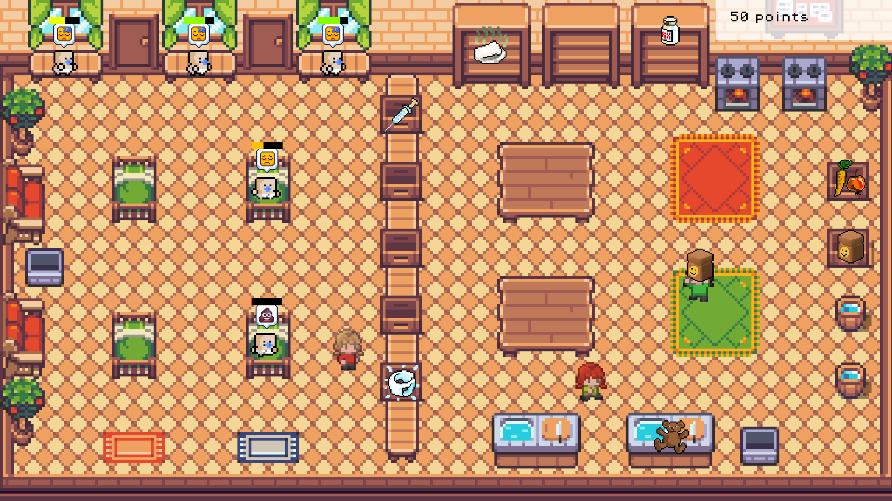

# Bombelki

Gra stworzona w ciągu 48 godzin 24-26 stycznia 2025 podczas [PolyJam 2025](https://polyjam.kntgpolygon.pl/) w Warszawie, w ramach [Global Game Jam](https://globalgamejam.org/).

Strona gry na globalgamejam.org: [Bombelki](https://globalgamejam.org/games/2025/bombelki-8)

[Video na YouTube](https://youtu.be/1o1EFc-jBvg)

Pobierz binarny build Windows do uruchomienia (nie wymaga instalacji): **[Game Executable > Bombelki.zip](https://globalgamejam.org/games/2025/bombelki-8)**

Repozytorium kodu źródłowego: [github.com/noxytrux/BooRocky](https://github.com/noxytrux/BooRocky)

Użyty silnik: [Godot 4.3](https://godotengine.org/)

Twórcy: zespół "BooRocky" w składzie: Mildanach, Noxy, Reg, Xsalian.
